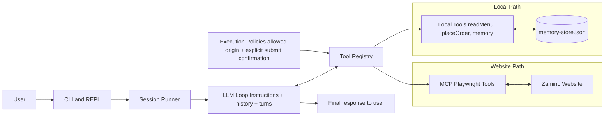

# Za


## Overview
Za is a minimal pizza-ordering agent designed to learn agent fundamentals in a real, concrete workflow.

I built this project to internalize the core primitives of agent systems that include model-driven reasoning, iterative tool-use loops, context management, and memory across sessions.

Instead of staying in toy prompts, Za can both use local ordering tools and navigate a live demo pizza site (Zamino's) with browser automation, while enforcing guardrails like domain restrictions and explicit confirmation before final submission.

**Important Concepts Learned:**
- The five primitives of agentic systems: an LLM, a loopable session, context window, tool access, system prompt to define behaviour
- Long-term memory using simple JSON file for caching user details like recent and favorite orders
- Support for defining an MCP config and integrating a 3rd party MCP server
- Building a REPL and CLI for interacting with the agent and persist

**Live site**: https://za-website.onrender.com/


## High-level System View

Live: https://mermaid.ai/d/77fe5294-8589-461a-b8b5-05e0a8eb9dde



1. User states desired pizza and quantity. If no quantity is provided the model will normally default to 1.
2. System receives request and determines what tools are available.
3. The user's order and allowed tools are passed to the model along with general prompt instructions.
4. Given this context, the model decides what to do each turn.
    - In the likely happy path, it first calls `readMenu` to find a valid menu item.
    - It then calls `placeOrder` with the selected item and quantity.
    - In some turns, it may emit multiple tool calls before returning a final answer.
5. After the order is placed the model will decide that the task has been completed and return the result.
6. If an error (bad tool arguments, bad JSON parsing, etc.) occurs during the steps above, the agent
   will retry on the next step. Only if an unknown tool is selected will the agent stop.
7. The system will track the 5 most recent orders by the user. It will also remember their preferred order
   when specified.

## Setup

Install dependencies:

```bash
bun install
```

Run one-shot:

```bash
bun run src/index.ts run "order 2 pepperoni pizzas"
```

Run interactive REPL (default):

```bash
bun run src/index.ts
# or after linking bin: za
```

Use `za` as a global CLI binary:

```bash
bun install
bun link
```

Ensure Bun's bin directory is in your `PATH` (typically `~/.bun/bin`), then run:

```bash
za # active interactive REPL
za run "I want a pizza"
```

## Local Website

Run Zamino's website locally:

```bash
bun run dev:website
```

Open `http://localhost:3099`.

Useful website routes for testing:

- `/menu`
- `/confirmation`
- `/api/menu`
- `/api/orders/latest`

## Deploy Website on Render

Create a Render **Web Service** that points to this repo and configure:

- Runtime: `Node`
- Build Command: `bun install`
- Start Command: `bun run start:website`
- Health Check Path: `/api/health`

Notes:

- `src/website/server-config.ts` reads `PORT` from the environment (with local fallback to `3099`).
- Keep instance count at 1 for more consistent in-memory website order state during demos.

## Environment

Required environment variables:

- `OPENAI_API_KEY`
- `AUTHENTICATED_USER_ID` (UUID)
- `MCP_PLAYWRIGHT_ENABLED` (set to `true` to enable Playwright MCP tools)

Test the agent against Zamino's website:
```bash
bun run src/index.ts run "I want two full stack pizzas from http://localhost:3099/"
```

## Development

Format:

```bash
bunx --bun @biomejs/biome format --write
```

## REPL

Commands:

- `/help`
- `/reset`
- `/exit` | `:q`

Activity stream:

- REPL mode shows compact activity lines for turn/tool progress.
- One-shot `run` mode stays focused on the final response output.

## Website Discovery Safeguards

- Browser final-submit actions require explicit user confirmation in a separate turn.
- Browser navigation is restricted to the discovered website origin from the user-provided URL.
