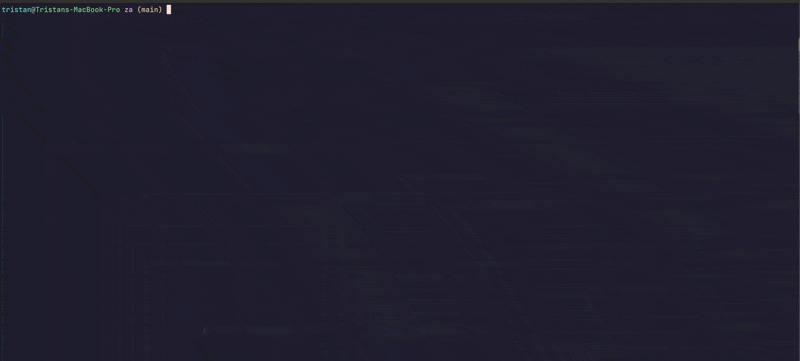
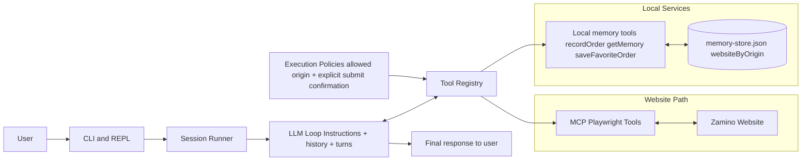

# Za 🍕




## Overview
Za is a minimal pizza-ordering agent designed to learn agent fundamentals in a real, concrete workflow.

I built this project to practice working with the core primitives of agent systems that include model-driven reasoning, iterative tool-use loops, context management, and memory across sessions.

Instead of staying in toy prompts, Za drives website ordering end-to-end on a live demo pizza site (Zamino's) with browser automation, while enforcing guardrails like domain restrictions and explicit confirmation before final submission.

**Important Concepts Learned:**
- The five primitives of agentic systems: an LLM, a loopable session, context window, tool access, system prompt to define behaviour
- Long-term memory using simple JSON file for caching user details like recent and favorite orders
- Support for defining an MCP config and integrating a 3rd party MCP server
- Building a REPL and CLI for interacting with the agent and persist

**Live site**: https://za-website.onrender.com/


## High-level System View



### Core UX Flow
1. The user submits an order request in the CLI/REPL with a website URL (first turn requires a URL).
2. The session runner builds the model turn context: system instructions, conversation history, and the currently available tools.
3. The model plans the next action and can either respond directly or call one or more tools in a turn.
4. Tool calls are routed through the unified tool registry, which dispatches to:
   - local memory tools (`recordOrder`, `getMemory`, `saveFavoriteOrder`), and
   - MCP Playwright tools for website discovery and ordering flows.
5. Execution policies are enforced before tool execution (for example, allowed website origin and explicit confirmation before final submit).
6. Tool results are returned to the model, which continues the loop until it can produce a final user-facing result.
7. If a recoverable error occurs (invalid args, parsing/tool failure), the loop continues so the model can retry with corrected actions.
8. Memory is updated after successful ordering: recent orders and favorites are tracked per website origin.

## Getting started

Preq:
- Bun runtime installed: https://bun.com/docs/installation
- OpenAI API key: https://platform.openai.com/api-keys 

Install dependencies:

```bash
bun install
```

Set env variables

```bash
cp .env.example .env
```

And set your `OPENAI_API_KEY` key or the agent won't work. Playwright MCP is required and enabled by default.

Start local website
```bash
bun run dev:website
```

Test agent via headless request:

```bash
bun run src/index.ts run "order 1 full stack and 1 null pointer pizza from http://localhost:3099/"
```

Run interactive REPL (default):

```bash
bun run src/index.ts
```

### Running as binary
Use `za` as a global CLI binary:

```bash
bun install
bun link
```

Ensure Bun's bin directory is in your `PATH` (typically `~/.bun/bin`), then run:

```bash
za # activate interactive REPL
za run "I want a pizza from https://za-website.onrender.com"
```


## Development

Format:

```bash
bunx --bun @biomejs/biome format --write
```

## REPL

Commands:

- `/help`
- `/reset`
- `/exit` | `:q`
